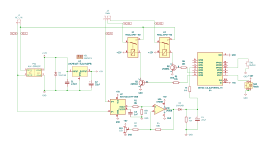

# Garage ESPHome Controller

## Overview

This project provides a comprehensive solution for automating and monitoring a garage door using the **ESP32-C3 Super Mini** microcontroller. The controller integrates seamlessly with **Home Assistant** via **ESPHome**, enabling smart home automation and remote control.

## Key Features

- **ESPHome integration** for easy Home Assistant setup and monitoring
- **Current sensor** for accurate detection of fully open/closed garage door states by monitoring motor current
- **External push button** support for manual operation
- **12V remote receiver** compatibility (e.g., [INEL ORS-X1T](https://allegro.pl/oferta/radiowy-sterownik-do-bram-inel-ors-x1t-10559594952)) for remote control
- **Compact hardware design** fits standard enclosure with receiver
- **Complete KiCAD hardware design files** and **ready-to-use ESPHome YAML configuration**

## Hardware Requirements and Bill of Materials (BOM)

| ID          | Item                                 | Quantity | Description                                                                                           |
| ----------- | ------------------------------------ | -------- | ----------------------------------------------------------------------------------------------------- |
| U1          | LM2940T-5.0/NOPB vaoltage stabilizer | 1        | Package TO-220-3, output voltage 5V                                                                   |
| U2          | ACS712xLCTR-05B current sensor       | 1        | For motor current measurement <https://www.aliexpress.com/item/1005006830307802.html>, SOIC-8 package |
| U3          | LM358 operational amplifier          | 1        | Package DIP-8 W7.62mm                                                                                 |
| U4          | ESP32-C3 Super Mini                  | 1        | Main controller (recommended version with external antenna socket for optimal WiFi performance)       |
| K1,K2       | Relay module JW1aFSN-DC12V           | 1        | For garage door motor control                                                                         |
| C1          | Capacitor 470nF                      | 1        | Capacitor THT: D4.3mm W1.9mm P5.00mm                                                                  |
| C2          | Capacitor 22µF                       | 1        | Capacitor THT: D4.5mm P2.50mm                                                                         |
| C3          | Capacitor 1nF                        | 1        | Capacitor THT: D4.3mm W1.9mm P5.00mm                                                                  |
| C4          | Capacitor 22uF                       | 1        | Capacitor THT: D4.5mm P2.50mm                                                                         |
| D1,D2       | Diode 1N4148                         | 2        | Diode 1N4148 THT: DO-35 SOD27 P7.62mm Horizontal                                                      |
| HS1         | Heatsink                             | 1        | Heatsink for TO-220 <https://www.aliexpress.com/item/1005006082544471.html>                           |
| J1          | AC power connector                   | 1        | TerminalBlock MetzConnect: TerminalBlock MetzConnect Type101 RT01602HBWC 1x02 P5.08mm Horizontal      |
| J2          | Gate connector                       | 1        | TerminalBlock MetzConnect: TerminalBlock MetzConnect Type101 RT01603HBWC 1x03 P5.08mm Horizontal      |
| K1,K2       | Relay SPST-NO                        | 2        | Relay THT: Relay SPST Panasonic JW1 FormA                                                             |
| PS1         | HLK-30M12C 230V power supply         | 1        | Converter ACDC: Converter ACDC Hi-Link HLK-30M12C                                                     |
| Q1,Q2       | Transistor 2N5551                    | 2        | Package TO SOT THT: TO-92 Inline                                                                      |
| R1,R2,R5,R6 | Resistors 10k                        | 4        | Resistor THT: R Axial DIN0207 L6.3mm D2.5mm P7.62mm Horizontal                                        |
| R3,R4       | Resistor 68k                         | 2        | Resistor THT: R Axial DIN0207 L6.3mm D2.5mm P7.62mm Horizontal                                        |
| R7          | Resistor 4k7                         | 1        | Resistor THT: R Axial DIN0207 L6.3mm D2.5mm P7.62mm Horizontal                                        |
| R8          | Resistor 5k6                         | 1        | Resistor THT: R Axial DIN0207 L6.3mm D2.5mm P7.62mm Horizontal                                        |
| RV1         | 10k Potentiometer                    | 1        | Potentiometer THT: Potentiometer Runtron RM-065 Vertical                                              |
| SW1         | Button connector                     | 1        | TerminalBlock MetzConnect: TerminalBlock MetzConnect Type101 RT01602HBWC 1x02 P5.08mm Horizontal      |
| SW2         | Radio remote receiver connector      | 1        | TerminalBlock MetzConnect: TerminalBlock MetzConnect Type101 RT01604HBWC 1x04 P5.08mm Horizontal      |

## Electric circuit diagram

## Assembly & Integration

1. Use the provided KiCAD or Gerber files to manufacture the PCB. I recommend using [JLCPCB](https://jlcpcb.com) service, which offers high quality PCB boards for only $2.
2. Assemble the PCB using the schematic above.
3. Install all components in the enclosure, connect 230V power and your garage doors to the terminals. Optionally, you may connect external button or radio remote receiver.
4. Adjust the RV potentiometer such that there is 0V on R7.
5. Flash the ESP32-C3 Super Mini with the included ESPHome configuration.
6. Add the device to Home Assistant via ESPHome for full smart home integration.

## Additional Recommendations

- Use the ESP32-C3 Super Mini version with an external antenna socket and connect a suitable WiFi antenna.
- Ensure all wiring and installation comply with local electrical safety standards.

## License

This project is open source. Please refer to the repository for detailed license information.

---

For further assistance, consult the repository documentation or open an issue.
